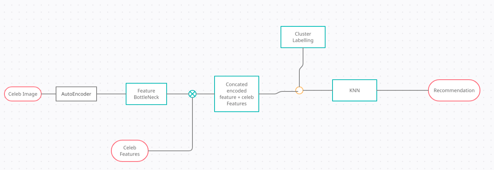
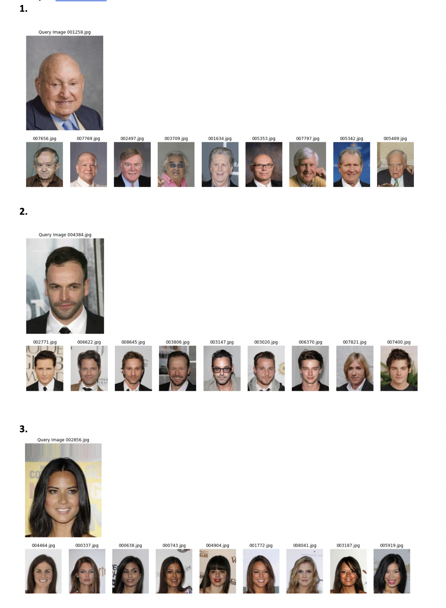

# Image-Recommendation
- The idea of Approach is to Built an pipeline to get Nearest search of input images
- The Algorithm Mainly divided into 3 parts explained below in Diagram 
- AutoEncoder: To get bottleneck features from images
- Kmean: To create cluster labels for KNN algorithm
- KNN: Building model to give N nearest recommendation 
DataSet: 
https://mmlab.ie.cuhk.edu.hk/projects/CelebA.html 

- sample output

